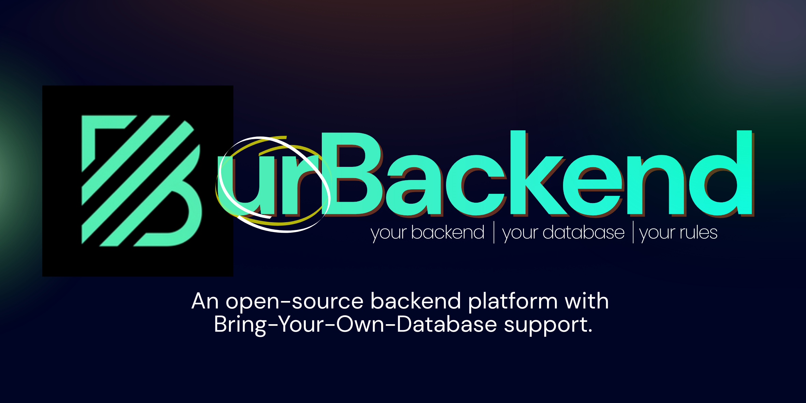
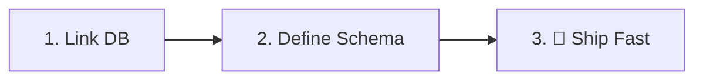

# urBackend 🚀

<p align="center">
  
</p>

<p align="center">
  <b>The Instant Backend-as-a-Service for Frontend Developers.</b><br/>
  <i>Bring your own MongoDB. Get a production-ready backend in 60 seconds.</i>
</p>

<p align="center">
  <a href="https://urbackend.bitbros.in"><strong>Dashboard</strong></a> ·
  <a href="docs/introduction.md"><strong>Docs</strong></a> ·
  <a href="https://discord.gg/CXJjvJkNWn"><strong>Discord</strong></a>
</p>

<div align="center">


</div>

---

## 💡 Why urBackend?

Building a backend is slow, repetitive, and expensive. urBackend flips the script by giving you **full control** without the **boilerplate**.

- **No Vendor Lock-in**: Connect your own MongoDB Atlas or self-hosted instance. Your data, your rules.
- **Speed to Production**: Go from zero to a live, secure REST API in under 60 seconds.
- **Frontend First**: Designed specifically to match the mental model of frontend developers.
- **Scalable by Design**: Built on industrial-strength tech (Node.js, Redis, BullMQ) to handle your growth.

---

## 🟢 Powerful Features

| Feature | Description |
| :--- | :--- |
| 🗄️ **Instant NoSQL** | Auto-generated REST APIs for your MongoDB collections. |
| 🔐 **Managed Auth** | Built-in Signup, Login, and JWT session management. |
| ☁️ **Cloud Storage** | Manage media assets with instant public CDN links. |
| 🔌 **BYO Database** | Already have data? Plug in your existing MongoDB cluster. |
| 🛡️ **Dual-Key Safety** | Separate Public/Secret keys for secure frontend/backend access. |
| 📊 **Real-time Analytics** | Monitor requests, storage, and health from a beautiful UI. |

---

## 🚀 How it Works



1.  **Initialize**: Create a project and link your MongoDB URI in the [Dashboard](https://urbackend.bitbros.in).
2.  **Model**: Visually define your collections and schemas—validation is handled automatically.
3.  **Execute**: Start hitting your auto-generated endpoints immediately.

### One-line Integration
```javascript
// Instant CRUD for any collection
const users = await fetch('https://api.urbackend.bitbros.in/api/data/users', {
  headers: { 'x-api-key': 'pk_live_...' }
});
```

---

## 🛠️ Tech Stack

urBackend is built with a focus on performance and reliability:

- **Runtime**: Node.js & Express
- **State/Queue**: Redis & BullMQ
- **Data Layer**: MongoDB (Mongoose)
- **Frontend**: React.js (Vite)
- **Styling**: Vanilla CSS & Lucide Icons
- **Deployment**: Integrated CI/CD via GitHub Actions

---

## 🤝 Community

We are building a community of faster builders. Join us!

- **Join the Discord**: [discord.gg/CXJjvJkNWn](https://discord.gg/CXJjvJkNWn)
- **Report Bugs**: [GitHub Issues](https://github.com/yash-pouranik/urbackend/issues)
- **Contribute**: Check out our [Contributing Guide](CONTRIBUTING.md)

---

## Contributors

<a href="https://github.com/yash-pouranik/urbackend/graphs/contributors">
  
</a>

Built with ❤️ by the **urBackend** community.
